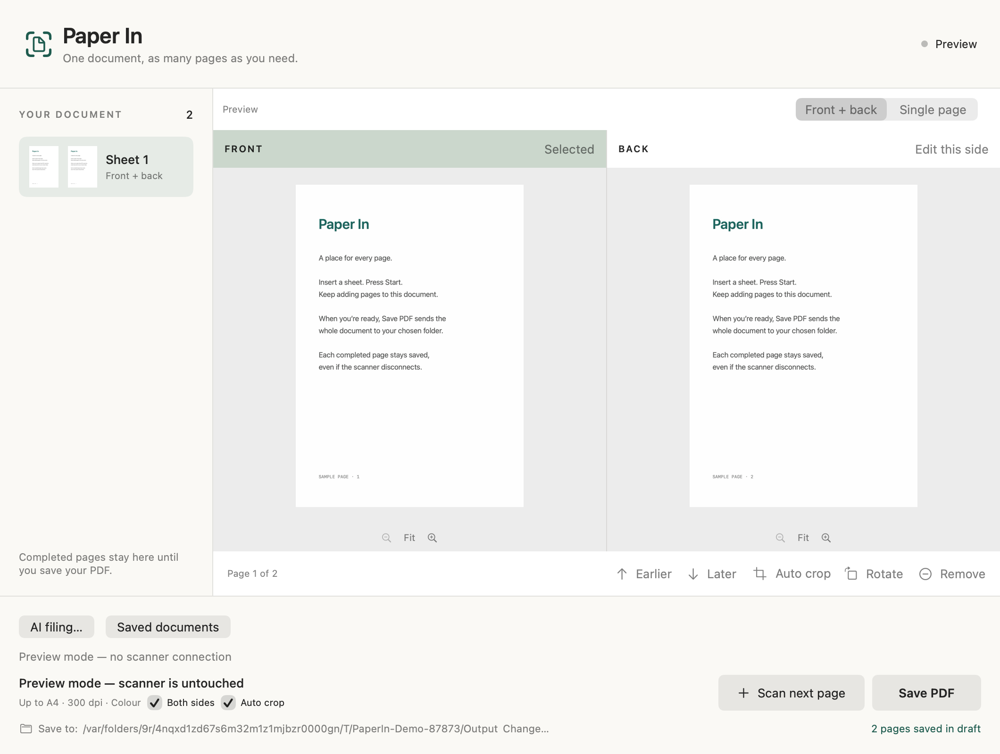

# Paper In

**Put the paper in. Scan. Save.**

A small Mac app for turning a stack of paper into PDFs you can find again. Built after one too many “no paper,” “jam,” and “could not connect” messages from the scanner's original software.

Paper In currently supports the **Brother DS-940DW over USB**, with experimental Wi-Fi support. It is an independent community project, not a Brother product.



## What it does

- **One document, as many pages as you need.** Scan a sheet, add another, save one PDF.
- **Front and back together.** Review each sheet, zoom either side, rotate, crop, or remove pages. Removed pages can be restored.
- **Recoverable drafts.** Completed pages are saved as you go, including across app restarts.
- **Optional AI filing.** Read the saved document, suggest a name and folder, check related documents, and file clear matches. Uncertain results wait for review.
- **Originals and Undo.** AI filing keeps the original PDF. Existing files are not overwritten, and filing can be undone.

Scanning works without an AI account. AI filing is off by default.

## Get it running

This is an early project built from source. There is no signed installer yet. The build is tested on Apple Silicon; macOS 14 or later is required. Other Mac architectures and scanner models are not yet verified.

You need Apple's Xcode Command Line Tools (or Xcode), **Node.js 22+**, and npm. If the Apple tools are missing, run `xcode-select --install` first.

```sh
git clone https://github.com/kellygold/paper-in.git
cd paper-in
./build.sh
open '.build/Paper In.app'
```

The build installs pinned AI SDKs inside the project and signs the app for local use. It does not change your global CLI installations or replace an installed Paper In app. To install it, quit any running copy and copy `.build/Paper In.app` into your Applications folder.

The app bundle is currently about 515 MB because it contains both provider runtimes. Node itself is not bundled. [Build details and development commands →](docs/development.md)

## Scan your first document

1. Put the DS-940DW in USB mode, connect it, and close other scanner apps.
2. Open Paper In, choose your destination folder with **Change…**, then click **Connect**.
3. Insert a sheet and click **Scan** or press Space. Repeat to add sheets to the same document.
4. Review the pages and click **Save PDF** or press Command-S.

The destination is remembered. Saving starts a fresh document. The scanner's physical Start button is not supported yet; use the app button or Space.

For Wi-Fi, first connect the scanner to the same local network as your Mac, select **Wi-Fi** in Paper In, then **Connect**. The preview, draft, PDF and AI filing workflow stays the same. See [Wi-Fi setup](docs/wifi.md) for the phone-assisted setup that keeps your Mac online and the current validation limits.

To explore the UI without a scanner:

```sh
open -n '.build/Paper In.app' --args --demo
```

Demo mode uses generated pages, temporary storage, and no AI requests.

## Let AI organize the saved PDFs

Open **AI filing…**, enable filing, and choose a provider:

| Connection | Setup |
| --- | --- |
| Codex | Use the official runtime's existing login with `codex login`. |
| Claude | Use the official runtime's existing login with `claude auth login`. |
| OpenAI or Anthropic API | Enter a model ID and an API key. Keys are stored in macOS Keychain. API billing is separate. |

Existing-login integrations use the official SDKs. Availability depends on your provider's account, limits, and terms; see [provider setup and eligibility](docs/providers.md).

New saves go to `_Inbox` first. The worker extracts text locally, proposes a filename and folder, then makes a second AI call to check the proposal. You can keep scanning while it runs.

Open **Saved documents** to see progress, approve a suggestion, change its name or folder, retry, Undo, or **Show PDF in Finder**. New folders, weak OCR, possible duplicates, related documents, and disagreements between the two checks require review. Related files are never automatically merged.

Enabling AI does **not** retroactively organize PDFs saved before it was enabled. It applies to subsequent saves, including a draft started before enabling it.

**Privacy:** extracted text, folder names, and excerpts from up to eight candidate PDFs are sent to the selected provider. Page images stay local. This is text-based filing, so photographs without text will generally need manual organization. [Data storage, privacy, and recovery →](docs/privacy-and-recovery.md)

## Find your way around the code

There are two parts to the app: the Mac interface and the AI filing process. They share one document workflow.

```text
app/          Mac app: screens, scanner connections, documents, AI settings
ai/           AI filing: OCR, providers, naming, folders, review, Undo
tests/        Automated checks and opt-in synthetic integration tests
docs/         Architecture, provider setup, development, test evidence
scripts/      Build and test helpers
build.sh      Build the app
test.sh       Build and run the automated checks
```

Start with [the project map](docs/project-map.md). It explains which file to open for common changes. The [architecture guide](docs/architecture.md) describes the shared contracts and how to add a scanner or AI provider.

A new model supported by an existing provider only needs a model ID in settings. A new provider or scanner gets an adapter; previews, storage, review, and recovery stay shared.

## Contribute

```sh
./test.sh
```

The default tests use synthetic documents and fake scanners/providers. No account, API key, or connected scanner is needed to run them. CI runs the same command on macOS. Live provider checks are separately opt-in.

See [contributing](docs/contributing.md) for a first change, [test evidence](docs/validation.md) for what is verified, and [troubleshooting](docs/troubleshooting.md) for scanner or filing problems.

## Current limits

- DS-940DW only. Wi-Fi is experimental; one physical duplex scan through the shared backend is verified. Other scanner models and multi-sheet feeders are not yet supported. See [validation](docs/validation.md) for the tested scope.
- Capture is A4, 300 dpi, colour. Automatic crop handles small items; long receipts and deskew are not implemented.
- OCR feeds AI filing; PDFs do not yet receive a searchable text layer.
- Very large exports may briefly pause the interface. Drafts and recovery copies are retained without automatic cleanup.
- AI can misread or misclassify documents. Its second check uses the same provider, and confidence is a heuristic. Review and Undo remain available.

## License

Paper In's original source is [MIT licensed](LICENSE). Dependencies keep their own licenses, including the proprietary Claude SDK/runtime. See [third-party notices](docs/third-party.md). Public binary distribution still needs signing, notarization, and dependency redistribution review.
