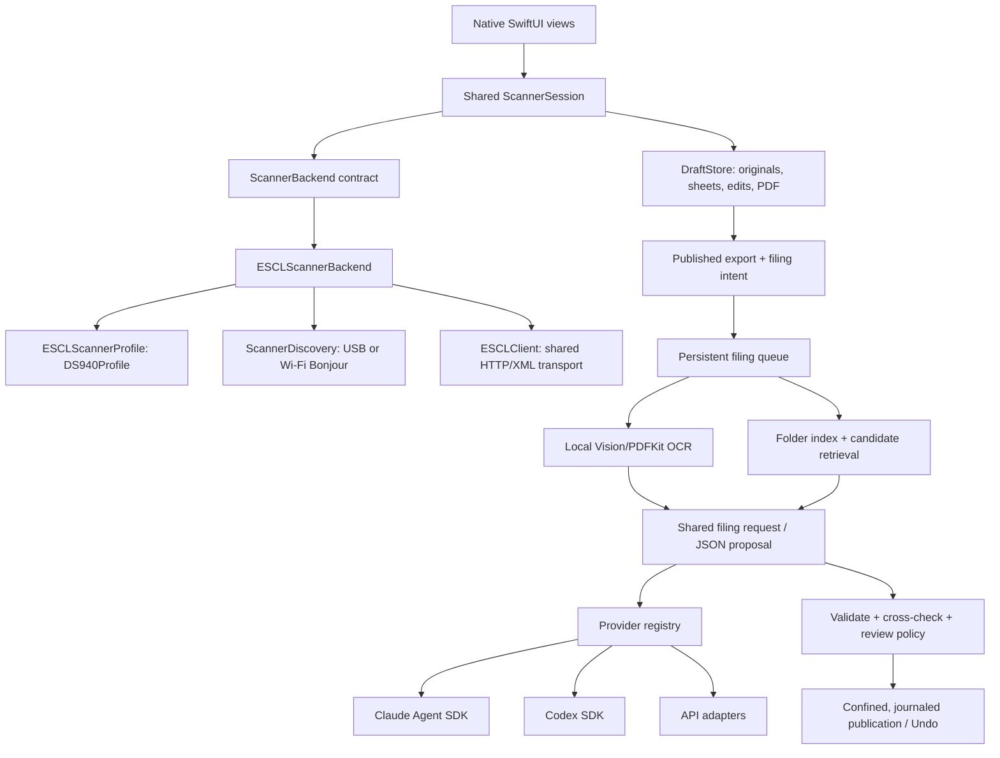

# Architecture

Status: 0.3.0 adds experimental Wi-Fi to the DS-940DW USB workflow. Hardware evidence is recorded in [validation](validation.md).

Start with [the project map](project-map.md) for a task-by-task guide to the files.

## Code map

- `app/scanning/ScannerBackend.swift`: hardware-independent options, capabilities, delivered images and backend contract; shared observable session. The UI depends on the session, not a device implementation.
- `app/scanning/ScannerCatalog.swift`: supported hardware composition. `DS940Profile` implements `ESCLScannerProfile` for model matching and request constraints. `ESCLScannerBackend` owns the shared job lifecycle; `ScannerDiscovery` supplies USB or network endpoints; `ESCLClient` owns generic HTTP/XML transport validation.
- `app/documents/DraftStore.swift`: durable originals, draft manifest, capture IDs/sides, reversible edits and PDF publication. Sheet pairing is preserved even if a side is removed or capture fails. Legacy pages are not inferred into pairs.
- `app/documents/BlankPageDetector.swift`: strict local bright-paper classification. `ShadowedPaperDetector.swift` adds a second pass for cropped items on a known scanner background, following the paper silhouette and distinguishing soft shadows from connected strokes. DraftStore applies blank skipping to either side, simplex scans and imports when enabled. Originals remain unchanged. The legacy `blankBackSkipped` metadata and `removed` state are recorded in the durable ingest envelope; front/back identity and received-image counts include skipped sides. Restoration clears the skip state, and existing pages are never automatically reclassified.
- `app/ui`: application state, window layout, shared page rendering and zoom. `app/documents/SheetGroup.swift` owns physical-sheet grouping.
- `app/filing`: native settings, catalog reader, Keychain access, worker lifecycle and queue/review UI.
- `ai/provider-catalog.json`: shared provider descriptors for the native UI and worker. A model is configuration, not a separate workflow.
- `ai/providers/registry.mjs`: provider implementations; adapters receive prompt, schema, settings, cancellation signal, credentials and an isolated runtime working directory. They return a proposal object. They do not move files or receive original PDF paths.
- `ai/schema.mjs`: proposal validation and shared prompts. The engine makes a first proposal and a second evidence check; the review policy is independent of provider choice.
- `ai/engine.mjs`: durable job state transitions, export discovery, bounded indexing, classification and approval. `files.mjs` owns confined paths and no-clobber publication. `library.mjs` owns local OCR and candidate retrieval.
- `ai/ocr.m`: Objective-C Vision/PDFKit helper, keeping OCR local and avoiding a Swift/SDK module mismatch. Existing PDF text is used when present; otherwise each page is rendered and OCRed.

Swift controls the UX and scanning. The worker owns AI and filing transactions, with one process lock per application-data root. They exchange a JSON request over stdin/stdout, read a shared JSON queue format, and share the provider catalog. No long-running web server or remote service is required.

## Adding an AI provider or model

1. For a different model supported by an existing adapter, enter its model identifier in settings. No code change is necessary.
2. For a new provider, add an adapter in `ai/providers` implementing the same request/response contract. Keep its authentication and wire format there. Register it in `registry.mjs` and `provider-catalog.json`; native settings and Keychain handling pick it up automatically.
3. Add transport tests (success, missing credentials, authentication failure, rate limit, malformed/truncated response, cancellation). Run shared engine tests unchanged.
4. Run an opt-in synthetic live check. Never use someone's personal scans as release fixtures.

A provider may use HTTP, an official SDK or a supported local runtime. The generic engine does not branch on provider names. New authentication methods beyond runtime login/API key need an explicit descriptor and settings implementation; they are not silently guessed.

## Adding a scanner

1. Implement `ScannerBackend`: expose capabilities/state, connect/pause/retry, accept `ScanOptions`, and emit begin/image/end callbacks. Page callbacks must be acknowledged by durable storage before reporting success. Never automatically repeat a physical scan after uncertain delivery.
2. Register it in `ScannerCatalog`. One-sheet eSCL devices can implement `ESCLScannerProfile` and reuse `ESCLScannerBackend`, discovery and `ESCLClient`. Other acquisition protocols implement the same backend contract. The catalog injects model and transport; the draft and filing layers never branch on either.
3. Run the shared session contract tests, draft tests and a backend transport suite. Verify real single/duplex captures, empty feeder, jam, unplug/replug and sleep/wake before advertising the model.
4. A multi-sheet feeder or flatbed may require enriching options/capture metadata; do not assume the DS-940's one-sheet/two-images behavior applies universally.

## Persistence invariants

- Each received image is stored unchanged before the manifest acknowledges it.
- A published PDF's source bytes, hash, original location and filing settings are recorded with its export. This permits restart discovery without re-uploading legacy scans.
- Each queued job keeps its own original PDF. Analysis errors never remove it or the inbox copy.
- `queued → analyzing → review → publishing → filed`; interrupted analysis can retry. File publication and Undo record their intended targets before mutation and reconcile matching hashes on restart.
- Review is mandatory for changed proposals, new folders, relationships/duplicates, limited context, weak OCR or confidence below 0.92. This threshold is a product heuristic, not a statistical guarantee.
- Paths are relative to the chosen canonical root; dot paths, traversal and symlink components are rejected. Publishing uses atomic no-clobber links. Only an unchanged app-created inbox copy is cleaned up.
- Undo restores from the retained original and removes a filed copy only if its bytes still match. It never overwrites a user's changed file.
- No provider response is executable code. Model-suggested relationships cannot authorize merge, deletion or arbitrary filesystem access.

## Known boundaries

The current index hashes up to 1,500 PDFs, lists up to 300 folders, and reads eight ranked candidates. OCR prompts are capped and truncation forces review. It is deliberately bounded; larger archives need incremental indexing and stronger retrieval. OS-level disk/power failure guarantees remain limited by the filesystem; original retention is the recovery fallback.
